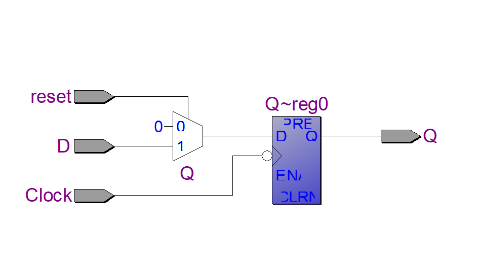

# D-FLIPDLOP-NEGEDGE

**AIM:**

To implement  D flipflop using verilog and validating their functionality using their functional tables

**SOFTWARE REQUIRED:**

Quartus prime

**THEORY**

**D Flip-Flop**

D flip-flop operates with only positive clock transitions or negative clock transitions. Whereas, D latch operates with enable signal. That means, the output of D flip-flop is insensitive to the changes in the input, D except for active transition of the clock signal. The circuit diagram of D flip-flop is shown in the following figure.


This circuit has single input D and two outputs Qtt & Qtt’. The operation of D flip-flop is similar to D Latch. But, this flip-flop affects the outputs only when positive transition of the clock signal is applied instead of active enable. The following table shows the state table of D flip-flop.


Therefore, D flip-flop always Hold the information, which is available on data input, D of earlier positive transition of clock signal. From the above state table, we can directly write the next state equation as Qt+1t+1 = D


Next state of D flip-flop is always equal to data input, D for every positive transition of the clock signal. Hence, D flip-flops can be used in registers, shift registers and some of the counters.

**Procedure**
1. Define Module: Define a Verilog module for the D flip-flop with inputs (D, CLK) and outputs (Q, Q_bar).
2. Declare Inputs and Outputs: Declare input and output ports for the module.
3. Implement Flip-Flop Logic: Write Verilog code to implement the D flip-flop logic based on its functional table. Use a synchronous always @(posedge CLK) block to trigger the flip-flop on the positive edge of the clock signal
4. Simulate Using Testbench: Write a Verilog testbench to simulate the behavior of the D flip-flop under different input conditions.
5. Apply Input Stimuli: In the testbench, apply various combinations of input stimuli (D, CLK) to cover all possible input states.
6. Verify Output Behavior: Verify that the output behavior of the D flip-flop matches the expected behavior defined by its functional table.
7. Check for Race Conditions: Ensure that there are no race conditions or undefined states in the design by analyzing the timing and sequence of input changes.

**PROGRAM**
```
/* 
Program for flipflops and verify its truth table in quartus using Verilog programming. 
Developed by: RAMESH RENUKA
RegisterNumber: 212223240136

module DFLIPFLOPNEGEDGE(D,Clock,reset,Q);
input D,reset,Clock;
output reg Q;
always @ (negedge Clock)
if(!reset)
Q <= 0;
else
Q <= D;
endmodule
*/
```
**RTL LOGIC FOR FLIPFLOPS**


**TIMING DIGRAMS FOR FLIP FLOPS**


**RESULTS**

Thus the program to implement a D flipflop using verilog and validating their functionality using their functional tables.

